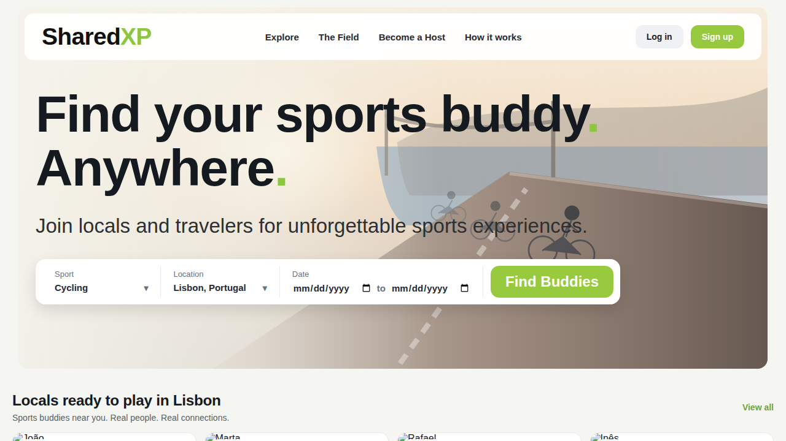
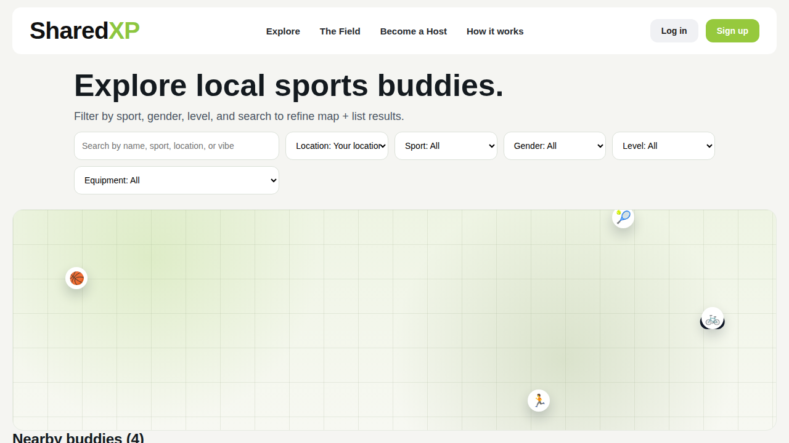
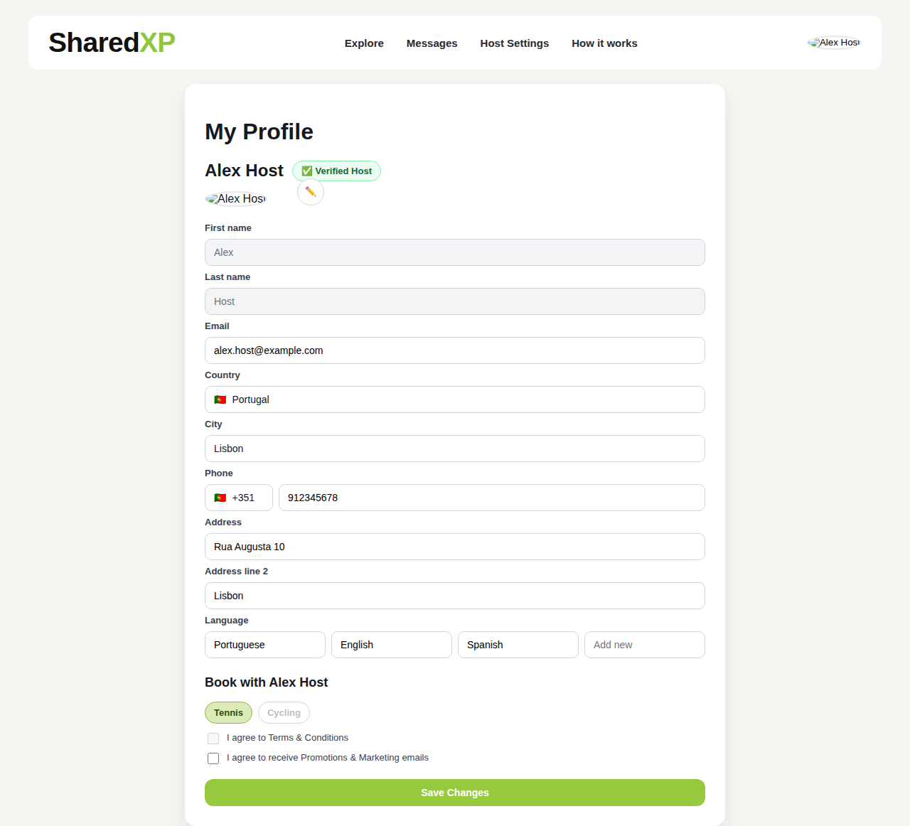
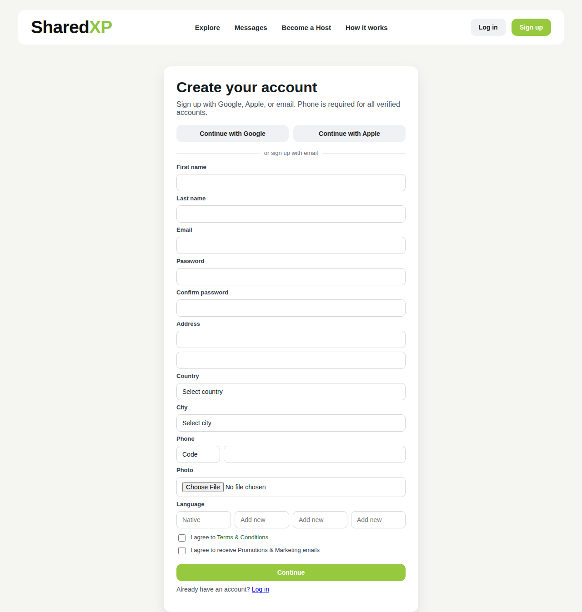
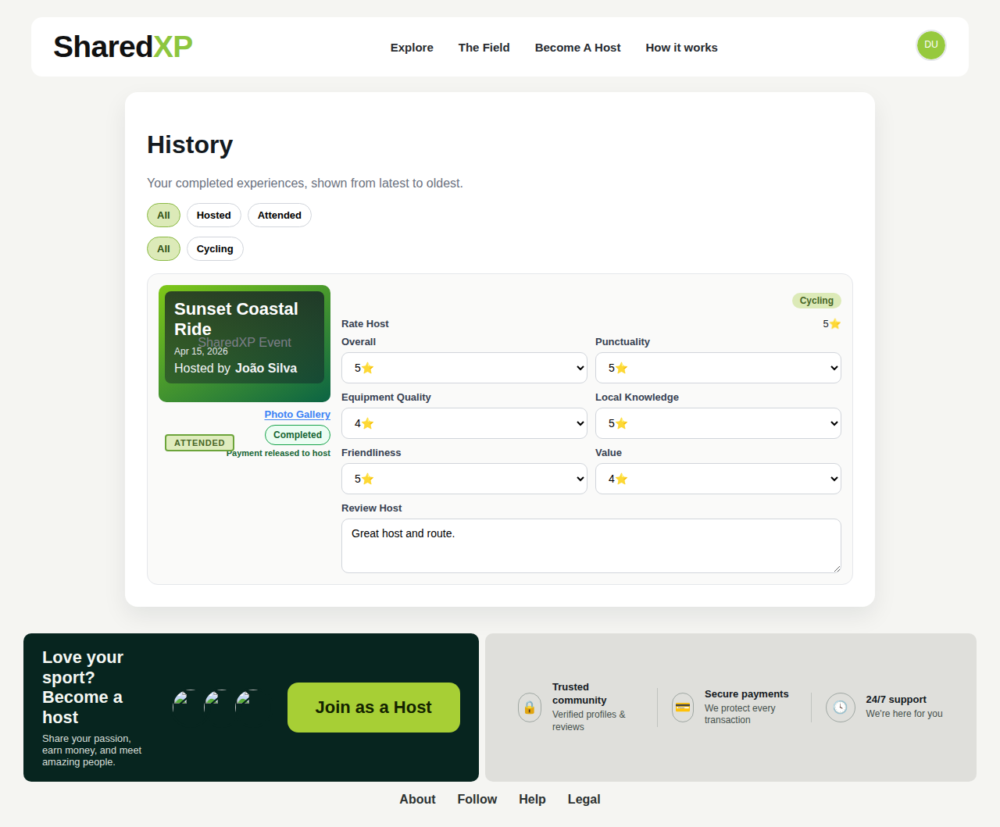

# SharedXP

> **Global C2C sport experience sharing platform.**  
> Find locals who share your sport at the places you travel — and do what you love without carrying any equipment.

-----

## The Idea

*“Every time I travel, I have to stop doing some of the things I do regularly back home. So I thought of this idea to engage locals to help travelers with their sport expertise, equipment and guidance. In return, hosts can make money for their service and travelers are more than happy to pay for it. It’s a win-win for all.”*

— **Alp R. Capa**, Founder & CEO

SharedXP connects sports-loving travelers with local people who are eager to share their experience and equipment. Whether you cycle, run, play tennis, surf, or shoot hoops — find a local buddy at your destination and stay active, even without your gear.

-----

## Screenshots

|Home                                                      |Explore                                                         |Profile                                                         |
|----------------------------------------------------------|----------------------------------------------------------------|----------------------------------------------------------------|
||||

|Sign Up                                                 |History                                              |
|--------------------------------------------------------|-----------------------------------------------------|
|||

-----

## Features

### For Travelers

- **Browse locals** — search by sport, city, level, gender, and equipment availability
- **Interactive map** — see nearby hosts plotted with distance sorting
- **Host profiles** — gallery, availability calendar, 6-dimension reviews, and pricing
- **Book a session** — pick a date and time, request a booking in a few taps
- **Session history** — view completed experiences, upload photos, leave reviews
- **Share to The Field** — post your session photos and caption to the community feed

### For Hosts

- **Host onboarding** — list one or more sports with availability, pricing, and equipment details
- **Host settings** — pause hosting, update profile, manage payout info
- **Host history** — view completed sessions and participants

### The Field

- Community experience feed sourced from real completed sessions
- Photo carousel on multi-image posts
- Filter by city and sport
- Share your own experience directly from History
- View host profiles from community posts
- Remove your own posts at any time

### Platform

- Sign up with email or social (Google / Apple — prototype)
- SHA-256 password hashing via Web Crypto API
- Legacy password migration on login
- Hosting paused indicator in nav

-----

## Tech Stack

|Layer     |Technology                |
|----------|--------------------------|
|Framework |React 18                  |
|Routing   |React Router v6           |
|Bundler   |Vite 5                    |
|Styling   |Custom CSS (no UI library)|
|Auth      |SHA-256 via Web Crypto API|
|Storage   |`localStorage` (prototype)|
|Deployment|Vercel                    |

No external UI libraries. No TypeScript. Zero additional npm dependencies beyond React, React Router, and Vite.

-----

## Project Status

🚧 **Frontend prototype.** The full user journey — browsing, profiles, sign-up, host onboarding, booking, history, and community feed — is demonstrated without a live backend. All data is stored in the browser’s `localStorage`.

### localStorage keys

|Key                   |Contents                    |
|----------------------|----------------------------|
|`sharedxp-users`      |All registered user accounts|
|`sharedxp-session`    |Currently logged-in user    |
|`sharedxp-field-posts`|User-generated Field posts  |

### Planned backend work

- Real database (users, bookings, reviews, posts)
- OAuth via Google & Apple
- Stripe Connect for host payouts
- Messaging / chat system
- Email notifications
- Moderation for The Field

-----

## Getting Started

```bash
# Clone the repo
git clone https://github.com/alpcapa/SharedXP.git
cd SharedXP

# Install dependencies
npm install

# Start the dev server
npm run dev
```

Open <http://localhost:5173> in your browser.

### Build for production

```bash
npm run build
npm run preview
```

-----

## Live Demo

👉 [project-gq4ge.vercel.app](https://project-gq4ge.vercel.app)

Sign up with any email and password to explore the full prototype. To test the host flow, sign up and go to **Become a Host** in the nav.

-----

## Folder Structure

```
src/
├── assets/              # Static images and SVGs
├── components/          # Shared UI (SiteHeader, SiteFooter, BuddyCard)
├── data/                # Mock data (buddies, field posts)
├── hooks/               # useAuth — all auth and user state logic
├── pages/               # One file per route
│   ├── HomePage.jsx
│   ├── ExplorePage.jsx
│   ├── ProfilePage.jsx
│   ├── FieldPage.jsx
│   ├── HistoryPage.jsx
│   ├── HostPage.jsx
│   ├── AboutPage.jsx
│   ├── MyProfilePage.jsx
│   ├── SignUpPage.jsx
│   ├── LoginPage.jsx
│   └── ...legal pages
├── utils/               # Date helpers
├── App.jsx              # Route declarations
├── main.jsx             # Entry point
└── style.css            # Global styles (~3,400 lines, no modules)
```

-----

## Routes

|Path            |Page                                                   |
|----------------|-------------------------------------------------------|
|`/`             |Home — hero, featured locals, sport chips, how it works|
|`/locals`       |Explore — map + filtered list of hosts                 |
|`/buddy/:id`    |Host profile — gallery, calendar, booking, reviews     |
|`/the-field`    |Community experience feed                              |
|`/about`        |About, story, how it works, values, CTA                |
|`/signup`       |Sign up                                                |
|`/login`        |Log in                                                 |
|`/my-profile`   |Edit personal profile                                  |
|`/become-a-host`|Host onboarding                                        |
|`/host-settings`|Manage host profile                                    |
|`/history`      |Booking history, photo upload, reviews, share to Field |
|`/how-it-works` |→ redirects to `/about`                                |

-----

## Mock Data

The prototype ships with 4 host buddies and 8 Field posts covering:

**Hosts:** Cycling · Tennis · Running · Basketball  
**Cities:** Lisbon · Porto · Barcelona · Berlin

Host availability dates are generated dynamically relative to today so the booking calendar always shows upcoming slots.

-----

## Photo Upload Notes

Photos uploaded in the History page are stored as base64 data URLs in `localStorage` alongside the session record. A limit of **5 photos per session** is enforced to stay within browser storage limits (~5MB total across all keys). For production this will be replaced with cloud storage (S3 or equivalent).

-----

## License

Private. All rights reserved © SharedXP.
